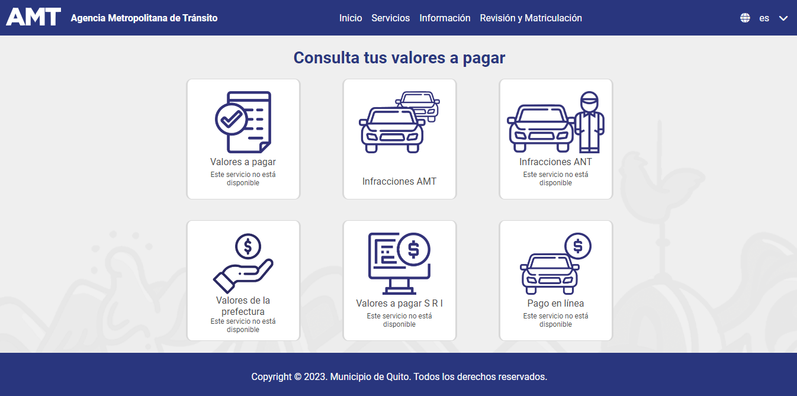
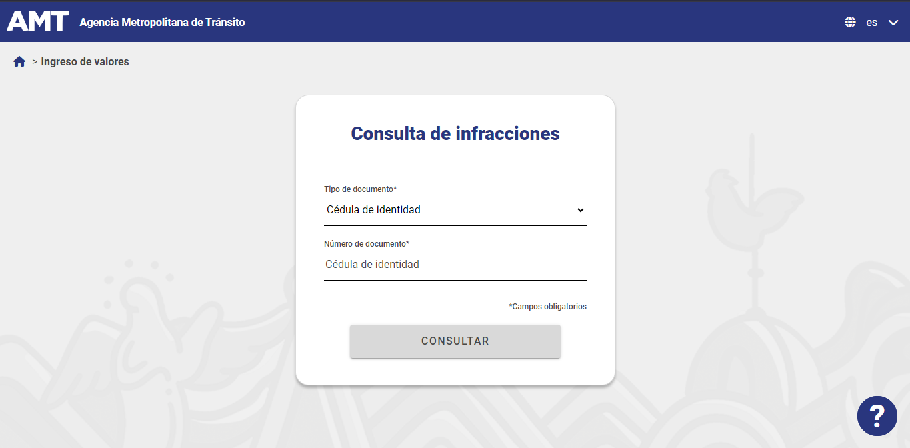
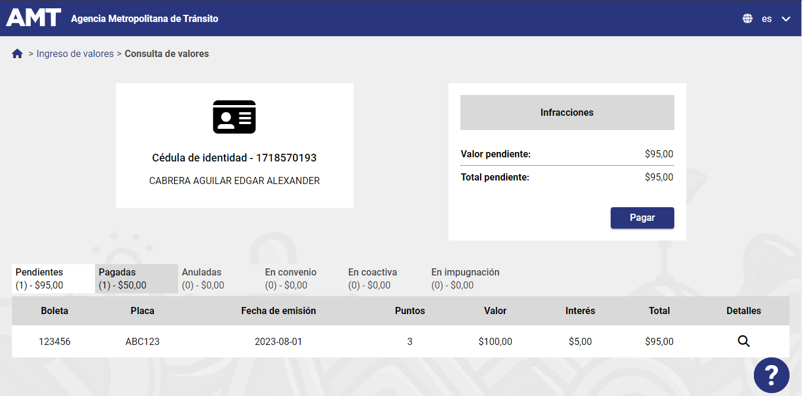
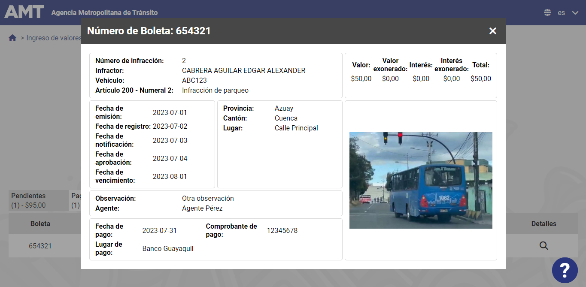

# Rediseño del Portal Web de Consulta de multas de la Agencia Metropolitana de Tránsito

Este proyecto consiste en un rediseño del portal web de consultas de multas de la Agencia Metropolitana de Tránsito (AMT) de Quito, Ecuador. El enfoque principal del proyecto está puesto en mejorar la Usabilidad y Accesibilidad del sitio web, buscando así brindar una experiencia de usuario más eficiente y accesible para todos los usuarios, incluyendo aquellos con discapacidades.

**Nota: Este proyecto es un prototipo de frontend, por lo tanto no se conecta a ningún servidor backend y todos los datos presentes en el prototipo son ficticios. Los datos simulados utilizados no representan información real de la Agencia Metropolitana de Tránsito de Quito.**

## Autores

- [Danny Cabrera](https://github.com/DonOtame): Diseñador de interfaz de usuario
- [Andrés Ponce](https://github.com/aPonce2001): Desarrollador Front-end
- [Dennis Lincango](https://github.com/Wolv-x): Evaluador de Usabilidad y Accesibilidad
- [Pavel Vásquez](https://github.com/PavelV11): Evaluador de Usabilidad y Accesibilidad

## Características del Producto Final

- **Nueva Interfaz de Usuario:** Hemos diseñado una interfaz de usuario completamente renovada, tomando en cuenta las necesidades y preferencias de nuestros usuarios, y basándonos en la caracterización de los grupos de usuarios (personas) construida en equipo.

- **Prototipado:** Hemos creado un prototipo funcional web que permite la interacción del usuario a nivel de front-end. A través de este prototipo, los usuarios podrán acceder y realizar consultas sobre multas de una manera más fluida y sencilla.

- **Enfoque en Usabilidad:** Nuestro rediseño se basa en los principios de las diez heurísticas de Nielsen, lo que garantiza una experiencia de usuario mejorada y sin obstáculos.

- **Accesibilidad:** Hemos evaluado y corregido el prototipo para cumplir con las pautas de accesibilidad establecidas por WCAG 2.2, asegurándonos de que el sitio web sea usable por personas con discapacidades visuales, auditivas y motoras.

- **Evaluación Rigurosa:** Para asegurar la calidad del rediseño, hemos sometido el prototipo a múltiples evaluaciones heurísticas y pruebas con usuarios generales y aquellos que simulan discapacidad visual, auditiva y motora, utilizando el cuestionario SUS para medir la satisfacción del usuario.

- **Retroalimentación:** Hemos corregido y mejorado el prototipo basándonos en los comentarios y resultados de las evaluaciones realizadas, asegurándonos de ofrecer un producto final altamente funcional y accesible.

## Capturas de Pantalla

## Datos de Prueba
Si deseas explorar y probar el proyecto, puedes utilizar los siguientes datos de muestra:
### Cédula de identidad
- Número de Identificación: 1718570193
### Placa de vehículo
- Número de Placa: ABC123
### Registro único de contribuyente (RUC)
- Número de RUC: 1706486170001
### Carnet de refugiado
- Número de Carné: R1234567
### Pasaporte
- Número de Pasaporte: A1234567

Ten en cuenta que estos son solo ejemplos de datos proporcionados para fines de prueba. Siéntete libre de utilizarlos para interactuar con el proyecto y observar cómo funciona.

## Tecnologías/Herramientas Utilizadas

- Figma: Utilizado para diseñar la primera versión del prototipo y la interfaz de usuario.
- Herramientas de Evaluación de Accesibilidad:
  - SortSite: Utilizado para evaluar la accesibilidad del prototipo funcional web.
  - Wave: Otra herramienta utilizada para evaluar la accesibilidad del prototipo funcional web.
- Cuestionario SUS: Aplicado a usuarios generales y personas que simulan discapacidad para evaluar la satisfacción del usuario.
- Tecnologías Web: Angular, HTML, CSS con Less, JavaScript, etc.
- Despliegue: GitHub Pages

## Licenciamiento

Este proyecto se encuentra bajo la [Licencia MIT](LICENSE). La Licencia MIT es una licencia de código abierto que permite a otros usuarios acceder, utilizar y contribuir al proyecto de manera libre, siempre y cuando mantengan la misma licencia para las derivaciones.

Este rediseño del portal web de consultas de multas busca facilitar el acceso a la información de tránsito, mejorar la experiencia del usuario y promover la inclusión de todas las personas, independientemente de sus habilidades y capacidades. Esperamos que esta nueva versión sea un gran paso hacia un servicio más eficiente y accesible para la comunidad de Quito.
